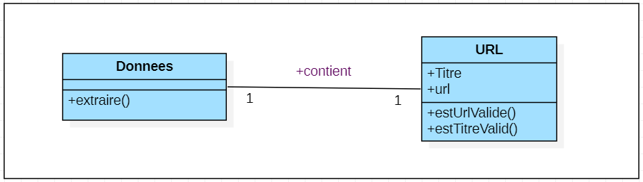
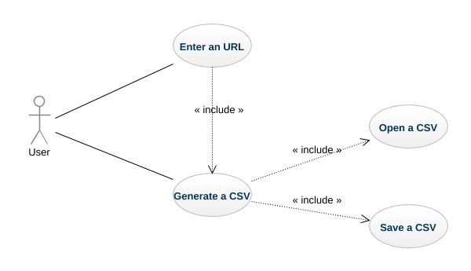

# Wikipedia Matrix : The Truth

This project has been realized during our Master of Business Informatics. Its objective is to parse tables from wikipedia into csv files. We had to extract those tables from HTML, parse them into csv files and compare the parsing quality, in order to choose which of those raw contents was able to give us the best csv files at the end of the process.

## Scope
This project allows the client to be able to extract data in the form of tables within a Wikipedia page and to return this data in a CSV file in order to be able to open and consult them in tools using the CSV format, for example Excel.

  
_Context diagram associate to system_

## UML Models"

### Class diagram
  
_Class diagram associate to system_

The two main entities to be considered are Wikitext data (named `Donnees_wikitext`) and HTML data (named `Donnees_html`). The `Donnees_html` class consists of a `htmlVersCSV()` function to retrieve the data and put it in the form of a CSV. The `Donnees_wikitable` class, on the other hand, is first composed of a data recovery function because Wikitext data needs additional processing compared to HTML data. It also has a function converting these data to CSV format.

These two classes inherit a parent class called `Donnees` representing all the information contained in a table on a Wikipedia page. It consists of a `extraire()` function to extract data from url (wikipedia) and a `pageComporteTableau()` function to check whether there is a table in the URL page filled in.

Directly linked to this class, the URL class allows to process the URL entered by the user, in particular thanks to the `estUrlValide()` function, which aims to check whether the URL returns to an existing Wikipedia page.

### Use Case diagram
  
_Use Case diagram associate to system_

Here we will consider that our user, external to the system of our program, is Mr Acher. This actor must therefore perform two actions in order for the processing to start:

* __Enter the Wikipedia page URL :__  
    As a user, I retrieve the URL of my Wikipedia page and insert it in the associated field.
    
* __Generate CSV file :__  
    As a user, I generate the CSV file by clicking a button and am able to download it.  
    This action includes two complementary actions :
    * _Open CSV file :_ As a user, I only want to open my CSV file to view it.
    * _Save CSV file :_ As a user, I want to save my CSV file to my local computer.
    
    
### Architecture"
 In this part , we will tell you about **the technical architecture** of the project and more precisely about the file parts;  
  
 First, we notice that the project is based on folders each of which contains a set of files of the same context;  for example , we focus on the "**doc**", "**img**" and "**output**" folders; they successively contain the **html files** **of the project**, **the images** used and the generated **csv files**.  
 Now , going to the heart of the project which is the "src" folder and which in turn contains two main folders: the "**main**" folder for the java classes (classes and exceptions) and the "**test**" folder for the test classes.

    
