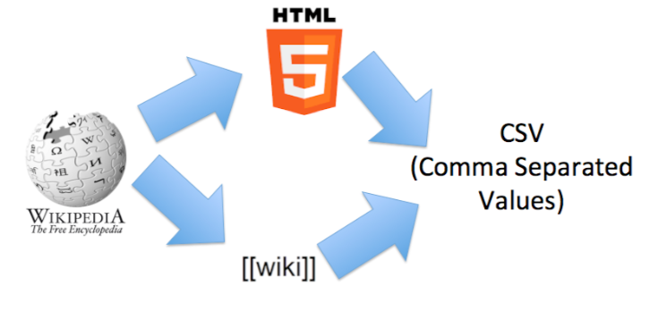

# PDL-GRP7
# Wikipedia Matrix : The Truth
 <br>

The aim of this PDL project is to extract tables in CSV format from Wikipedia pages. Those pages can be analyzed in two different ways:
By searching for the corresponding Wikitext code
By exploiting the HTML rendering of the Wikipedia page 

Both approaches would be compared and tested (in order to have the same CSV output).

### But why extract tables in Wikipedia?

Wikipedia tables are difficult to exploit by statistical tools, visualization or any tool able to exploit tables (e.g., Excel, OpenOffice, RStudio, Jupyter). These tables are written in a syntax (Wikitext) difficult to analyze and not necessarily designed for the specification of tables. In addition, there is a strong heterogeneity in the way tables are written, further complicating Wikipedia's tabular data processing. Same can be said for HTML format. 

### Why CSV (Comma separated values) ?
It is very simple and above all supported by many tools.

This project is about implementing a solution and specify a ground truth ("ground truth") and thus evaluate different extractors by confronting them to the ground truth. Also, it must be able to extract several tables on the same Wikipedia page.


Last but not least, this project will propose a set of tools able to analyze the results of the extractors and thus specify a set of expected results (which will then be used during the automatic test phase). Among these tools, one of them will allows to visualize a matrix (resulting from an automatic extractor), possibly to correct the matrix, and then to export it in CSV format.

Finally, a most global suite of tests will demonstrate the quality of our tool.

### Final result
There will be three concrete results:
Extractors of much better quality (with source code, documentation, test suite, continuous integration, etc.)
A suite of tools to be able to more easily specify a ground truth and thus help the evaluation of extractors
A dataset reusable by anyone wanting to test an array extractor

## Getting Started

These instructions will get you a copy of the project up and running on your local machine for development and testing purposes. See "Parsing wikitables" to start the parsing on a live system.

After cloning the project into your computer, either you open it on your IDE 

### Prerequisites

An IDE .

```
Pycharm - https://www.jetbrains.com/fr-fr/pycharm/
```


### Installing

How to install it ?


You can find more details in [INSTALL.md](https://github.com/chemy8/PDL-2020-2021-EX-GRP7/blob/main/INSTALL.md).


## Folders' structure

Folders:
- the root contains some files, as :
  
  1. INSTALL.md containing the install guide
  2. DESIGN.md cointaining projects' scope and its UML Model.
  3. README.md containing utils informations about project.
.
  

- the /src folder contains three folders :
  1. Donnee.py containing the implementation class of our extractor.
  2. Url containing url for test.
  3. wikiExtractMain is main class.

## Running the tests


## Parsing wikitables

For extracting from both HTML and WIKITEXT, you need to go:

On PyCharm : Double click on the green play button on your right.

Put Url you want extract.
```

```
## Supported and unsupported features (actual state)


##Future function


## Built With

* [Pycharm](https://www.jetbrains.com/fr-fr/pycharm/) - The IDE used
git config --global user.email johndoe@example.com
## Versioning

- prototype : the latest prototype built to test the concept

- V1 : in this version, last year group putted most HTML tables are parsed successfully. The project's structure is a non-Maven one, we could not run "Maven test". Also, in this version, urls parsing was executed one at a time.

- V2 : This version supports the Maven test command & has a simple UI allowing interaction with the user made by the earlier group.

- master : the lastest, stable version of the project.

- develop : our branch built to test the concept before committing it to master

## Authors

* **Lassana MAKADJI** - *Whole project* - [Lassana_Makadji](https://github.com/makadjilassana)
* **Rahima KONE** - *Whole project* - [Rahima_Koné](https://github.com/chemy8)
* **Mariem ROUISSI** - *Whole project* - [Mariem_Rouissi](https://github.com/Mrouissi)
* **Rebecca EHUA** - *Whole project* - [Rebecca_Ehua](https://github.com/CodeusedeReve)

##Project Context

This module takes place at the University of Rennes 1, ISTIC, in Master 1 (MIAGE). 
The objective of PDL is to carry out a software project with open technologies and data. 
There are many challenges to overcome, requiring skills in project management, modeling, and programming.
This scenario should make it possible to better understand and apprehend the difficulty of developing software in an extremely concrete context. 
Software development technics and tools (git, github, Maven, JUnit, etc.) well known to the industry will be used. 
Technological choices will also have to be made.

## License

This project haven't licence.

